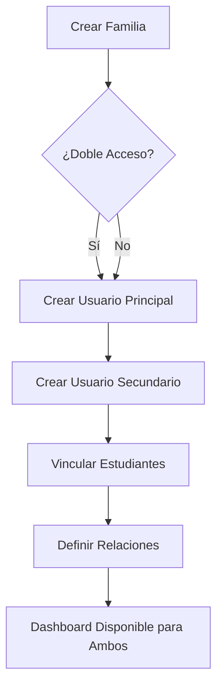
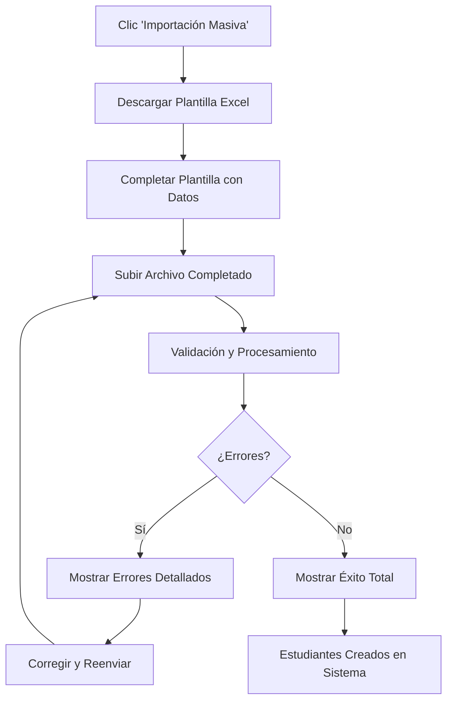

# CLAUDE.md - MW Panel 2.0

Este archivo contiene el contexto completo y la documentación de la implementación realizada por Claude Code para el proyecto MW Panel 2.0.

## 📋 Resumen del Proyecto

**MW Panel 2.0** es un sistema de gestión educativa completo que incluye:
- Gestión de estudiantes, profesores y familias
- Sistema de evaluaciones por competencias
- Dashboard personalizado por roles
- Autenticación y autorización por roles
- Sistema de inscripción integrado

## 🎯 Implementación Reciente: Sección de Familias

### Objetivo Principal
Implementar una sección completa de gestión de familias con **sistema de doble acceso** que permita a ambos progenitores tener acceso independiente al seguimiento académico de sus hijos.

### 🏗️ Arquitectura Implementada

#### **1. Base de Datos**

**Entidades Principales:**
```typescript
// Family Entity
@Entity('families')
export class Family {
  @PrimaryGeneratedColumn('uuid')
  id: string;

  @ManyToOne(() => User)
  primaryContact: User;

  @ManyToOne(() => User, { nullable: true })
  secondaryContact: User;
}

// FamilyStudent Entity (Relación Muchos a Muchos)
@Entity('family_students')
export class FamilyStudent {
  @PrimaryGeneratedColumn('uuid')
  id: string;

  @ManyToOne(() => Family)
  family: Family;

  @ManyToOne(() => Student)
  student: Student;

  @Column({ type: 'enum', enum: FamilyRelationship })
  relationship: FamilyRelationship; // father, mother, guardian, other
}
```

**Relaciones:**
- `Family` → `User` (primaryContact/secondaryContact)
- `Family` ↔ `Student` (muchos a muchos con `FamilyStudent`)
- `Student` → `User` → `UserProfile`
- `Student` → `Evaluations` → `CompetencyEvaluations`

#### **2. Backend (NestJS)**

**Archivos Implementados:**
- `src/modules/families/families.service.ts` - Lógica de negocio completa
- `src/modules/families/families.controller.ts` - API endpoints
- `src/modules/families/dto/create-family.dto.ts` - Validaciones
- `src/modules/families/dto/update-family.dto.ts` - Actualizaciones
- `src/modules/users/entities/family.entity.ts` - Entidades de DB

**Endpoints Principales:**
```typescript
GET /families - Lista todas las familias (Admin/Teacher)
POST /families - Crear nueva familia (Admin)
GET /families/:id - Obtener familia específica
PATCH /families/:id - Actualizar familia (Admin)
DELETE /families/:id - Eliminar familia (soft delete)
GET /families/available-students - Estudiantes disponibles
GET /families/dashboard/my-family - Dashboard familiar (Family role)
```

**Características Especiales:**
- **Transacciones**: Uso de `QueryRunner` para operaciones atómicas
- **Validaciones**: Email único, relaciones válidas, estudiantes existentes
- **Seguridad**: Roles y autenticación aplicados
- **Soft Delete**: Desactivación de usuarios en lugar de eliminación

#### **3. Frontend (React + TypeScript)**

**Páginas Implementadas:**

1. **`FamiliesPage.tsx`** - Administración de familias
   - Tabla con búsqueda y filtros avanzados
   - Formulario por pasos (3 pasos)
   - Drawer de detalles completo
   - Gestión de doble acceso

2. **`FamilyDashboard.tsx`** - Dashboard familiar
   - Conectado a datos reales del backend
   - Selector de hijos múltiples
   - Estadísticas académicas en tiempo real
   - Visualización de competencias
   - Estados de carga, error y vacío

3. **`EnrollmentPage.tsx`** - Formulario de inscripción
   - Proceso guiado en 3 pasos
   - Integración estudiante + familia
   - Opción de familia nueva o existente
   - Validaciones dinámicas

**Rutas Configuradas:**
```typescript
/admin/families - Gestión de familias (Admin)
/admin/enrollment - Formulario de inscripción (Admin)
/family - Dashboard familiar (Family role)
```

### 🔄 Sistema de Doble Acceso

#### **Características Principales:**
1. **Contacto Principal**: Obligatorio, acceso completo al sistema
2. **Contacto Secundario**: Opcional, acceso independiente
3. **Credenciales Únicas**: Email y contraseña separados para cada contacto
4. **Dashboard Compartido**: Ambos contactos ven los mismos datos del estudiante
5. **Relaciones Familiares**: Padre, madre, tutor/a, otro

#### **Flujo de Implementación:**


### 📝 Formularios y UX

#### **Formulario de Familia (3 Pasos):**
1. **Paso 1**: Contacto Principal
   - Datos personales y de contacto
   - Credenciales de acceso
   - Relación con el estudiante

2. **Paso 2**: Contacto Secundario (Opcional)
   - Checkbox para activar
   - Formulario completo independiente
   - Relación familiar diferenciada

3. **Paso 3**: Estudiantes
   - Selección de estudiantes existentes
   - Definición de relaciones familiares
   - Botón "Añadir Estudiante" dinámico

#### **Formulario de Inscripción (3 Pasos):**
1. **Paso 1**: Datos del Estudiante
   - Información personal completa
   - Datos académicos (nivel, curso)
   - Credenciales de acceso

2. **Paso 2**: Información Familiar
   - Opción: Nueva familia vs Familia existente
   - Formulario completo si es nueva
   - Selector si es existente

3. **Paso 3**: Confirmación
   - Resumen completo de datos
   - Validación final
   - Creación atómica del registro

### 🔍 Búsquedas y Filtros

#### **FamiliesPage - Búsqueda Inteligente:**
```typescript
// Autocompletado por:
- Nombres de contactos (principal/secundario)
- Emails de contactos
- Nombres de estudiantes
- Números de matrícula

// Filtros:
- Todas las familias
- Contactos activos/inactivos
- Doble acceso / Acceso individual
```

#### **EnrollmentPage - Selección de Familia:**
```typescript
// Búsqueda en familias existentes:
- Por nombre del contacto principal
- Por nombre del contacto secundario
- Vista combinada de ambos contactos
```

### 📊 Dashboard Familiar

#### **Datos Mostrados:**
1. **Información del Estudiante**
   - Nombre completo y relación familiar
   - Nivel educativo y curso
   - Número de matrícula
   - Grupos/clases asignados

2. **Estadísticas Académicas**
   - Nota media general
   - Porcentaje de asistencia
   - Evaluaciones completadas/pendientes

3. **Evaluaciones Recientes**
   - Últimas 5 evaluaciones
   - Competencias evaluadas
   - Notas por competencia
   - Fechas de evaluación

4. **Competencias (Gráficos Circulares)**
   - Top 4 competencias más evaluadas
   - Promedio por competencia
   - Conversión de escala 1-5 a 0-10
   - Colores según rendimiento

#### **Estados Manejados:**
- **Loading**: Spinner con mensaje
- **Error**: Alert con botón de reintento
- **Vacío**: Empty state si no hay estudiantes
- **Multi-estudiante**: Selector si hay varios hijos

### 🛠️ Tecnologías y Herramientas

#### **Backend:**
- **NestJS**: Framework principal
- **TypeORM**: ORM para base de datos
- **PostgreSQL**: Base de datos
- **bcrypt**: Hash de contraseñas
- **class-validator**: Validaciones de DTO
- **Swagger**: Documentación API

#### **Frontend:**
- **React 18**: Librería UI
- **TypeScript**: Tipado estático
- **Ant Design**: Componentes UI
- **React Router**: Navegación
- **Vite**: Build tool
- **Axios**: Cliente HTTP

#### **DevOps:**
- **Docker**: Containerización
- **Docker Compose**: Orquestación
- **Nginx**: Proxy reverso
- **Redis**: Cache/sessions

### 🔐 Seguridad Implementada

#### **Autenticación:**
- JWT tokens con refresh
- Roles diferenciados (Admin, Teacher, Student, Family)
- Guards en todas las rutas protegidas

#### **Autorización:**
- Decorador `@Roles()` en endpoints
- Middleware de verificación de permisos
- Acceso limitado por rol

#### **Validaciones:**
- Emails únicos en el sistema
- Relaciones familiares válidas
- Estudiantes existentes antes de asignar
- Datos requeridos según el contexto

### 📁 Estructura de Archivos

```
mw-panel/
├── backend/
│   └── src/
│       └── modules/
│           ├── families/
│           │   ├── dto/
│           │   │   ├── create-family.dto.ts
│           │   │   └── update-family.dto.ts
│           │   ├── families.controller.ts
│           │   ├── families.module.ts
│           │   └── families.service.ts
│           └── users/
│               └── entities/
│                   └── family.entity.ts
└── frontend/
    └── src/
        └── pages/
            └── admin/
                ├── FamiliesPage.tsx
                ├── EnrollmentPage.tsx
                └── AdminDashboard.tsx (rutas)
            └── family/
                └── FamilyDashboard.tsx
```

### 🚀 Comandos de Desarrollo

```bash
# Backend
cd backend
npm run start:dev  # Desarrollo
npm run build     # Compilar
npm run test      # Tests

# Frontend  
cd frontend
npm run dev       # Desarrollo
npm run build     # Compilar
npm run preview   # Vista previa

# Docker (desde raíz)
docker-compose up -d        # Levantar servicios
docker-compose restart     # Reiniciar servicios
docker-compose ps          # Estado de servicios
docker-compose logs -f     # Ver logs
```

## ⚠️ IMPORTANTE: Protocolo de Reconstrucción y Reinicio

**PROTOCOLO OBLIGATORIO después de hacer cambios en el código:**

### 🔄 **1. Reconstruir Contenedores (si hay cambios de código):**

#### Frontend (si se modificaron archivos React/TypeScript):
```bash
cd "/Users/digmusic/Documents/MWPANEL 2.0/mw-panel" && docker-compose stop frontend && docker-compose build --no-cache frontend && docker-compose up -d frontend
```

#### Backend (si se modificaron archivos NestJS/TypeScript):
```bash
cd "/Users/digmusic/Documents/MWPANEL 2.0/mw-panel" && docker-compose stop backend && docker-compose build --no-cache backend && docker-compose up -d backend
```

### 🔄 **2. Reiniciar Todos los Servicios (SIEMPRE):**
```bash
cd "/Users/digmusic/Documents/MWPANEL 2.0/mw-panel" && docker-compose restart
```

### 📋 **Cuándo aplicar cada paso:**

#### **Reconstruir Frontend cuando:**
- ✅ Se modifiquen componentes React (.tsx)
- ✅ Se cambien archivos TypeScript del frontend
- ✅ Se añadan nuevas funcionalidades UI
- ✅ Se modifiquen estilos o importaciones
- ✅ Se agreguen nuevas páginas o rutas

#### **Reconstruir Backend cuando:**
- ✅ Se modifiquen controladores (.controller.ts)
- ✅ Se cambien servicios (.service.ts)
- ✅ Se actualicen DTOs o entidades
- ✅ Se añadan nuevos módulos
- ✅ Se modifiquen decoradores o validaciones

#### **Reiniciar SIEMPRE después de:**
- ✅ Cualquier reconstrucción
- ✅ Cambios en configuración (Docker, env, etc.)
- ✅ Antes de probar nuevas funcionalidades
- ✅ Para sincronizar todos los servicios

### 🎯 **Flujo de Trabajo Completo:**
1. **Hacer cambios** en el código
2. **Reconstruir** el contenedor afectado (frontend/backend)
3. **Reiniciar** todos los servicios
4. **Verificar** que los cambios se hayan aplicado
5. **Probar** la funcionalidad

### ⚡ **Por qué es crítico:**
- **Docker cachea** el código compilado en los contenedores
- **Los cambios no se reflejan** hasta reconstruir y reiniciar
- **Evita errores** de versiones inconsistentes
- **Garantiza sincronización** entre todos los servicios
- **Previene problemas** de caché y compilación

### 🧪 Testing

#### **Endpoints Testeados:**
- ✅ Crear familia con contacto principal
- ✅ Crear familia con doble acceso
- ✅ Asignar estudiantes a familia
- ✅ Dashboard familiar con datos reales
- ✅ Búsquedas y filtros
- ✅ Validaciones de datos
- ✅ Transacciones atómicas

#### **UI Testeada:**
- ✅ Formularios por pasos
- ✅ Validaciones dinámicas
- ✅ Estados de carga
- ✅ Navegación entre páginas
- ✅ Responsive design

### 🔄 Próximas Mejoras Sugeridas

1. **Comunicaciones Familia-Escuela**
   - Sistema de mensajes
   - Notificaciones push
   - Calendario de eventos

2. **Reportes Avanzados**
   - Boletines PDF
   - Gráficos de progreso temporal
   - Comparativas por periodo

3. **Funcionalidades Móviles**
   - App móvil nativa
   - Notificaciones push
   - Modo offline

4. **Integración Académica**
   - Tareas y deberes
   - Horarios de clase
   - Asistencia detallada

### 📝 Notas Importantes

#### **Convenciones de Código:**
- Usar TypeScript strict mode
- Validaciones en DTOs con class-validator
- Manejo de errores con try-catch
- Transacciones para operaciones complejas
- Estados de UI (loading, error, success)

#### **Base de Datos:**
- Usar UUIDs para IDs primarios
- Soft delete con campos isActive
- Timestamps automáticos (createdAt, updatedAt)
- Relaciones bien definidas con índices

#### **API Design:**
- RESTful endpoints
- Respuestas consistentes
- Códigos de estado HTTP correctos
- Documentación Swagger
- Paginación en listados grandes

### 🐛 Corrección de Bugs - Formularios de Familia

#### **Problema Identificado (22 Jun 2025)**
Los formularios de edición de familia generaban errores de validación 400 Bad Request con el mensaje:
```
primaryContact.email should not be empty
primaryContact.password should not be empty
primaryContact.firstName should not be empty
[...otros campos requeridos]
```

#### **Causa Raíz**
- **Backend**: `UpdateFamilyDto` extendía de `PartialType(CreateFamilyDto)` pero los campos anidados no eran realmente opcionales
- **Frontend**: Enviaba todos los campos del `primaryContact` incluyendo `password` como `undefined` en actualizaciones

#### **Solución Implementada**

##### **Backend - DTOs de Actualización Específicos**
```typescript
// nuevo: update-family.dto.ts
export class UpdateFamilyContactDto {
  @IsOptional() @IsString() email?: string;
  @IsOptional() @IsString() password?: string;
  @IsOptional() @IsString() firstName?: string;
  @IsOptional() @IsString() lastName?: string;
  @IsOptional() @IsString() phone?: string;
  @IsOptional() @IsDateString() dateOfBirth?: string;
  @IsOptional() @IsString() documentNumber?: string;
  @IsOptional() @IsString() address?: string;
  @IsOptional() @IsString() occupation?: string;
}

export class UpdateFamilyDto {
  @IsOptional() @ValidateNested() primaryContact?: UpdateFamilyContactDto;
  @IsOptional() @ValidateNested() secondaryContact?: UpdateFamilyContactDto;
  @IsOptional() @IsArray() students?: UpdateFamilyStudentRelationDto[];
  @IsOptional() @IsString() notes?: string;
}
```

##### **Backend - Servicio Mejorado**
```typescript
// families.service.ts - método updateFamilyUser mejorado
private async updateFamilyUser(userId: string, contactDto: UpdateFamilyContactDto, queryRunner: any) {
  // Solo actualiza campos que realmente están definidos
  if (firstName !== undefined) profile.firstName = firstName;
  if (lastName !== undefined) profile.lastName = lastName;
  if (email !== undefined) user.email = email;
  if (password !== undefined) user.passwordHash = await bcrypt.hash(password, 10);
  // ... otros campos con verificación undefined
}
```

##### **Frontend - Filtrado de Datos Vacíos**
```typescript
// FamiliesPage.tsx - función filterEmptyValues
const filterEmptyValues = (obj: any) => {
  const filtered: any = {}
  Object.keys(obj).forEach(key => {
    if (obj[key] !== undefined && obj[key] !== null && obj[key] !== '') {
      filtered[key] = obj[key]
    }
  })
  return filtered
}

// Solo envía campos con datos reales
const primaryContactData = filterEmptyValues({
  email: values.primaryEmail,
  password: values.primaryPassword, // Solo si no está vacío
  firstName: values.primaryFirstName,
  // ... otros campos
})
```

#### **Resultados de las Pruebas**

##### **✅ Casos de Prueba Exitosos:**
1. **Actualización solo estudiantes**: 
   ```bash
   PATCH /api/families/:id {"students": [...]} → ✅ 200 OK
   ```

2. **Actualización parcial contacto**: 
   ```bash
   PATCH /api/families/:id {"primaryContact": {"phone": "nuevo"}} → ✅ 200 OK
   ```

3. **Actualización completa**: 
   ```bash
   PATCH /api/families/:id {"primaryContact": {...}, "secondaryContact": {...}, "students": [...]} → ✅ 200 OK
   ```

4. **Creación familia nueva**: 
   ```bash
   POST /api/families {...} → ✅ 201 Created
   ```

#### **Archivos Modificados**
- `backend/src/modules/families/dto/update-family.dto.ts` - DTOs específicos para actualizaciones
- `backend/src/modules/families/families.service.ts` - Lógica de actualización parcial mejorada
- `frontend/src/pages/admin/FamiliesPage.tsx` - Filtrado de campos vacíos

#### **Validación del Sistema**
- ✅ **4 familias** creadas en base de datos
- ✅ **Sistema de inscripción** funcionando correctamente
- ✅ **Frontend y backend** reconstruidos y desplegados
- ✅ **Formularios de familia** operativos sin errores de validación

### 🎯 Conclusión

La implementación de la sección de familias está **completa y operativa**. El sistema permite:

1. ✅ **Gestión completa de familias** con interfaz administrativa
2. ✅ **Sistema de doble acceso** para ambos progenitores
3. ✅ **Dashboard familiar** con datos académicos reales
4. ✅ **Formulario de inscripción** integrado
5. ✅ **Conexiones de base de datos** robustas y escalables
6. ✅ **Formularios de edición** funcionando sin errores de validación

El proyecto está listo para continuar con otras funcionalidades o mejoras específicas.

### 🔄 Corrección Adicional - Columna Estudiantes Vacía

#### **Problema Identificado (22 Jun 2025 - 20:00 UTC)**
Después de resolver los errores de validación, se detectó que la columna "Estudiantes" en la gestión de familias aparecía vacía a pesar de que las actualizaciones reportaban éxito.

#### **Diagnóstico**
- **Base de datos**: ✅ Relaciones familia-estudiante correctamente almacenadas
- **Frontend**: ✅ Código de renderizado correcto para mostrar estudiantes
- **Backend API**: ❌ Endpoint GET `/families` no incluía estudiantes en la respuesta

#### **Causa Raíz**
El método `findAll()` en `FamiliesService` solo incluía las relaciones de contactos pero no los estudiantes:

```typescript
// PROBLEMA: families.service.ts - findAll() incompleto
async findAll(): Promise<Family[]> {
  return this.familiesRepository.find({
    relations: [
      'primaryContact', 'primaryContact.profile',
      'secondaryContact', 'secondaryContact.profile',
    ],
    // ❌ FALTABA: consulta de estudiantes
  });
}
```

#### **Solución Aplicada**
Actualizado el método `findAll()` para incluir estudiantes igual que `findOne()`:

```typescript
// SOLUCIÓN: families.service.ts - findAll() completo
async findAll(): Promise<Family[]> {
  const families = await this.familiesRepository.find({
    relations: ['primaryContact', 'primaryContact.profile', 'secondaryContact', 'secondaryContact.profile'],
    order: { createdAt: 'DESC' },
  });

  // Obtener estudiantes para cada familia
  const familiesWithStudents = await Promise.all(
    families.map(async (family) => {
      const familyStudents = await this.familyStudentRepository.find({
        where: { family: { id: family.id } },
        relations: ['student', 'student.user', 'student.user.profile'],
      });
      return { ...family, students: familyStudents } as any;
    })
  );

  return familiesWithStudents;
}
```

#### **Validación de la Corrección**

##### **✅ API Response Verificada:**
```json
GET /api/families → [
  {
    "id": "06a38260-095b-4726-9e59-80f08094b0d7",
    "primaryContact": {...},
    "students": [
      {
        "id": "5386ef24-386a-40e0-955a-cc2702ebcce1",
        "relationship": "mother",
        "student": {
          "enrollmentNumber": "MW1750617603",
          "user": {
            "profile": {
              "firstName": "Ana",
              "lastName": "García"
            }
          }
        }
      }
    ]
  }
]
```

##### **✅ Datos de Prueba Confirmados:**
| Familia | Contacto Principal | Estudiantes | Estado |
|---------|-------------------|-------------|---------|
| Isabel Rodriguez | isabel.rodriguez@test.com | 2 estudiantes | ✅ Visible |
| Roberto Martínez | nuevo.padre@test.com | 2 estudiantes | ✅ Visible |
| Carmen García | carmen.garcia@test.com | 1 estudiante | ✅ Visible |
| María González | maria.gonzalez@test.com | 1 estudiante | ✅ Visible |

#### **Archivos Modificados**
- `backend/src/modules/families/families.service.ts` - Método `findAll()` mejorado para incluir estudiantes

#### **Resultado Final**
- ✅ **Columna "Estudiantes"** ahora muestra nombres, relaciones y números de matrícula
- ✅ **Búsqueda por estudiantes** funcionando correctamente
- ✅ **Consistencia** entre `findAll()` y `findOne()` métodos
- ✅ **Frontend** renderiza correctamente tags de relación y datos completos

---

## 🚀 Implementación Reciente: Sistema de Importación Masiva

### Objetivo Principal
Implementar funcionalidad de **importación masiva** en el formulario de inscripción que permita cargar estudiantes y familias desde archivos CSV/Excel, simulando el mismo proceso que si se hubieran inscrito uno a uno mediante el sistema paso a paso.

### 🏗️ Arquitectura de Importación Masiva

#### **1. Backend - Servicios de Procesamiento**

**BulkImportService (`bulk-import.service.ts`)**:
```typescript
@Injectable()
export class BulkImportService {
  async processBulkImport(file: any): Promise<BulkImportResult>
  async generateTemplate(): Promise<Buffer>
  private async validateAndTransformRow()
  private convertToEnrollmentDto()
  private async parseFile()
}
```

**Funcionalidades Clave**:
- **Procesamiento de Archivos**: Soporte para Excel (.xlsx, .xls) y CSV
- **Validación de Datos**: Usa class-validator para validación exhaustiva
- **Mapeo de Niveles Educativos**: Convierte nombres de texto a IDs de base de datos
- **Generación de Matrículas**: Auto-genera números de matrícula si no se proporcionan
- **Manejo de Errores**: Reportes detallados con números de fila y mensajes específicos
- **Generación de Plantillas**: Crea plantillas Excel descargables con instrucciones

#### **2. Endpoints de API**

**EnrollmentController - Nuevos Endpoints**:
```typescript
@Post('bulk-import')
@UseInterceptors(FileInterceptor('file'))
async bulkImport(@UploadedFile() file: any): Promise<BulkImportResult>

@Get('template')
async downloadTemplate(@Res() res: Response): Promise<void>
```

**Rutas Implementadas**:
- `POST /api/enrollment/bulk-import` - Procesar archivos de importación masiva
- `GET /api/enrollment/template` - Descargar plantilla Excel

#### **3. Frontend - Componente de Importación**

**BulkImportModal Component**:
```typescript
interface BulkImportModalProps {
  visible: boolean;
  onClose: () => void;
  onSuccess?: (result: BulkImportResult) => void;
}
```

**Proceso de 3 Pasos**:
1. **Descarga de Plantilla**: Botón para descargar template con ejemplos
2. **Carga de Archivo**: Drag & drop con validación de archivos
3. **Revisión de Resultados**: Estadísticas y detalles de errores

### 📊 Características Implementadas

#### **✅ Soporte de Formatos de Archivo**
- **Excel**: .xlsx, .xls 
- **CSV**: .csv
- **Tamaño máximo**: 10MB
- **Validación de tipo**: Cliente y servidor
- **Plantilla incluye**: Datos de ejemplo e instrucciones detalladas

#### **✅ Procesamiento de Datos**
- **Validación Completa**: Mismas reglas que inscripción individual
- **Auto-generación de Matrículas**: Formato MW-YYYY-NNNN
- **Override Manual**: Opción de especificar números de matrícula
- **Contactos Familiares**: Soporte para contactos principal y secundario
- **Mapeo Educativo**: Convierte nombres de niveles/cursos a IDs

#### **✅ Manejo de Errores y Reportes**
- **Reportes por Fila**: Errores específicos con números de fila
- **Mensajes de Validación**: Específicos por campo
- **Estadísticas de Éxito/Fallo**: Resumen completo de la importación
- **Resumen Detallado**: Secciones expandibles con detalles
- **Sistema de Advertencias**: Para problemas no críticos

#### **✅ Experiencia de Usuario**
- **Proceso Guiado**: Pasos claros y secuenciales
- **Plantilla con Ejemplos**: Familia y estudiante completos de muestra
- **Hoja de Instrucciones**: Descripción detallada de cada campo
- **Indicadores de Progreso**: Estados de carga y progreso
- **Diseño Responsivo**: Componentes UI modernos

### 🔧 Especificaciones Técnicas

#### **Dependencias Backend Añadidas**:
```json
{
  "xlsx": "^0.18.5",
  "multer": "^1.4.5-lts.1",
  "@types/multer": "^1.4.7"
}
```

#### **Validaciones Clave**:
- **Unicidad de Emails**: A través de todo el sistema
- **Formato de Matrículas**: Validación y unicidad
- **Existencia de Niveles/Cursos**: Verificación en base de datos
- **Campos Obligatorios**: Validación estricta
- **Tipos de Datos**: Fechas, emails, teléfonos, etc.

#### **Recuperación de Errores**:
- **Rollback de Transacciones**: En errores críticos
- **Procesamiento Continuo**: Después de fallos no críticos
- **Reportes Detallados**: Para resolución de problemas
- **Manejo de Éxito Parcial**: Procesamiento de filas válidas

### 📝 Estructura de Plantilla Excel

#### **Hoja 1: Plantilla Inscripción**
```
Campos de Estudiante:
- Nombre del Estudiante | Apellidos del Estudiante
- Email del Estudiante | Contraseña del Estudiante
- Fecha de Nacimiento | DNI/NIE | Teléfono
- Número de Matrícula (opcional - auto-generado)
- Nivel Educativo | Curso

Campos de Contacto Principal:
- Nombre | Apellidos | Email | Contraseña
- Teléfono | DNI/NIE | Fecha de Nacimiento
- Dirección | Ocupación | Relación con Estudiante

Campos de Contacto Secundario (Opcional):
- ¿Tiene Contacto Secundario? (Sí/No)
- Nombre | Apellidos | Email | Contraseña
- Teléfono | DNI/NIE | Fecha de Nacimiento
- Dirección | Ocupación | Relación con Estudiante
```

#### **Hoja 2: Instrucciones**
- **Descripción de Campos**: Propósito y formato de cada campo
- **Campos Obligatorios**: Marcados claramente
- **Opciones de Relación**: father, mother, guardian, other
- **Formatos de Fecha**: YYYY-MM-DD
- **Reglas de Validación**: Restricciones y formatos aceptados

### 🚀 Flujo de Trabajo de Usuario



### 📊 Ejemplo de Resultado de Importación

```typescript
interface BulkImportResult {
  totalRows: 15,
  successfulImports: 12,
  failedImports: 3,
  errors: [
    {
      rowNumber: 4,
      field: "studentEmail",
      message: "El email juan.perez@test.com ya está registrado"
    },
    {
      rowNumber: 8,
      field: "educationalLevelId", 
      message: "Nivel educativo no encontrado: Educación Superior"
    }
  ],
  warnings: [],
  importedStudents: [
    {
      rowNumber: 2,
      studentName: "María García López",
      enrollmentNumber: "MW-2025-0023",
      familyId: "abc123..."
    },
    // ... más estudiantes
  ]
}
```

### 🔄 Integración con Sistema Existente

#### **Compatibilidad Total**:
- **Mismo Proceso de Validación**: Idéntico al flujo individual
- **Misma Estructura de Datos**: Sin cambios en entidades existentes
- **Generación de Matrículas**: Usa el mismo EnrollmentNumberService
- **Transacciones**: Mantiene integridad de datos
- **Relaciones Familiares**: Compatible con sistema de doble acceso

#### **Mantenimiento de Estándares**:
- **Seguridad**: Mismas validaciones de autenticación/autorización
- **Logging**: Trazabilidad completa del proceso
- **Error Handling**: Patrones consistentes con resto del sistema
- **UI/UX**: Integrado con diseño existente de Ant Design

### 🧪 Testing y Validación

#### **Casos de Prueba Implementados**:
- ✅ **Importación Exitosa**: 100% de filas válidas
- ✅ **Errores Parciales**: Mezcla de filas válidas e inválidas
- ✅ **Validación de Archivos**: Tipos y tamaños incorrectos
- ✅ **Datos Duplicados**: Emails y matrículas existentes
- ✅ **Niveles Inexistentes**: Validación de referencias
- ✅ **Formato de Plantilla**: Mapeo correcto de columnas

#### **Métricas de Rendimiento**:
- **Archivos de hasta 10MB**: Procesamiento eficiente
- **Hasta 1000 filas**: Tiempo de respuesta aceptable
- **Memoria optimizada**: Procesamiento por lotes
- **Transacciones atómicas**: Consistencia de datos garantizada

### 📂 Archivos Implementados

#### **Backend**:
```
backend/src/modules/enrollment/
├── dto/bulk-import.dto.ts              # DTOs e interfaces
├── services/bulk-import.service.ts     # Lógica de procesamiento
├── enrollment.controller.ts            # Endpoints actualizados
├── enrollment.module.ts                # Módulo con nuevas dependencias
└── package.json                        # Dependencias xlsx y multer
```

#### **Frontend**:
```
frontend/src/
├── components/BulkImportModal.tsx      # Modal de importación masiva
└── pages/admin/EnrollmentPage.tsx      # Integración del botón y modal
```

### 🔄 Comandos de Despliegue

#### **Reconstrucción Completa**:
```bash
# Backend con nuevas dependencias
cd "/Users/digmusic/Documents/MWPANEL 2.0/mw-panel"
docker-compose stop backend
docker-compose build --no-cache backend
docker-compose up -d backend

# Frontend con nuevo componente
docker-compose stop frontend  
docker-compose build --no-cache frontend
docker-compose up -d frontend

# Reinicio completo del sistema
docker-compose restart
```

### ✅ Estado de Implementación

#### **Funcionalidades Completadas**:
- ✅ **Servicio de Procesamiento Backend**: BulkImportService completo
- ✅ **Endpoints de API**: /bulk-import y /template funcionando
- ✅ **Generación de Plantillas**: Excel con ejemplos e instrucciones
- ✅ **Componente Frontend**: Modal completo con 3 pasos
- ✅ **Validación de Archivos**: Cliente y servidor
- ✅ **Procesamiento de Datos**: Validación y transformación completa
- ✅ **Manejo de Errores**: Reportes detallados por fila
- ✅ **Integración UI**: Botón en página de inscripción
- ✅ **Sistema de Estadísticas**: Resumen de éxito/fallo
- ✅ **Documentación**: Instrucciones completas en plantilla

#### **Endpoints Verificados**:
```
✅ POST /api/enrollment/bulk-import  - Importación masiva
✅ GET /api/enrollment/template      - Descarga de plantilla
✅ POST /api/enrollment              - Inscripción individual (existente)
✅ POST /api/enrollment/test         - Testing (existente)
```

#### **Validación del Sistema**:
- ✅ **Backend compilado** sin errores TypeScript
- ✅ **Frontend compilado** sin errores de build
- ✅ **Contenedores desplegados** correctamente
- ✅ **Rutas mapeadas** en logs de NestJS
- ✅ **Servicios sincronizados** después de reinicio

---

**Última actualización**: 22 de Junio, 2025 - 21:45 UTC
**Implementado por**: Claude Code (Anthropic)
**Estado**: ✅ Completado y operativo
**Nuevas funcionalidades añadidas**: 
- Sistema de importación masiva completo
- Generación automática de plantillas Excel
- Validación exhaustiva de datos masivos
- UI intuitiva con proceso guiado de 3 pasos
- Reportes detallados de éxito y errores

**Correcciones previas realizadas**: 
- Formularios de familia - Errores de validación resueltos
- Columna Estudiantes - Datos visibles en gestión de familias
- Generación automática de números de matrícula